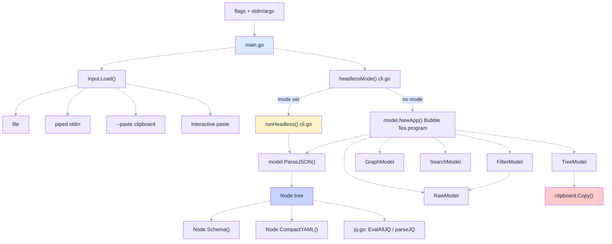

# Architecture

peep has two entry paths from `main.go`: an interactive Bubble Tea TUI, and a
headless path that runs a single operation and exits. Both share the same input
loader and the same `model` package for parsing and rendering JSON.

## Component overview



## Startup: resolving mode before loading input

`main.go` calls `headlessMode(query, schema, llm)` (`cli.go`) **before**
`input.Load`. `headlessMode` validates that at most one of `--query`, `--schema`,
`--llm` was passed and returns which single mode (if any) applies. This ordering is
deliberate: a flag-usage mistake (e.g. passing two of the three) fails fast with an
exit code, rather than risking the process blocking on the interactive-paste stdin
prompt inside `input.Load` first.

`input.Load(args, pasteFlag)` (`input/load.go`) then resolves the JSON source in
priority order — explicit file argument, piped stdin (detected with `isTerminal`),
`--paste` (system clipboard), or interactive paste (blocks on stdin until
`Ctrl+D`) — and returns a `Result{Data, Source, Name}`.

If a headless mode was resolved, `main.go` calls `runHeadless` and exits with its
return code. Otherwise it builds a `model.App` from the loaded data and runs it
under `tea.NewProgram(app, tea.WithAltScreen(), tea.WithMouseCellMotion())`.

## The JSON node tree

`model.ParseJSON` (`model/node.go`) unmarshals raw JSON into `interface{}` and
walks it into a `*Node` tree — the single representation every view and export
mode operates on. Object keys are sorted so tree order is deterministic; array
items carry `IsArrItem: true` so `Node.Path()` can render `foo[2]` instead of
`foo.2`. Every node keeps a `Parent` pointer, which is what makes `Path()` and the
tree view's collapse/expand walk possible without re-parsing.

Three read-only projections exist on top of `Node`, all in `model/export.go` and
`model/jq.go`:

- **`Node.Summary()`** — one-line value (`{3}`, `[5]`, `"foo"`, `42`, `true`) used
  for the status bar and clipboard "copy value".
- **`Node.Schema()`** — a compact, non-round-trippable shape description (field
  names, inferred types, one example scalar per field) — a token-cheap hint for
  prompting an LLM about a document's shape without sending the whole payload.
- **`Node.CompactYAML()`** — a dense, YAML-like serialization of the actual values
  (bare scalars where unambiguous, inline `[a, b, c]` for scalar arrays) — also
  one-way, optimized for prompt tokens rather than round-tripping. Use
  `Node.ToInterface()` + `json.Marshal` when you need real JSON back out.

`model/jq.go` shares one `parseJQ(data, expr)` helper between two callers with
different result semantics: `FilterModel.Eval` (in `filter.go`) takes only the
*first* result, for a fast interactive live preview; `EvalAllJQ` takes *every*
result the `gojq` program yields — including continuing past a per-output runtime
error — mirroring how the real `jq` CLI behaves, which is what `--query` needs.

## The Bubble Tea model tree

`App` (`model/app.go`) is the root `tea.Model`. It owns one instance of each view
sub-model — `TreeModel`, `GraphModel`, `RawModel`, `SearchModel`, `FilterModel` —
all built once in `NewApp` from the same parsed `Node` tree (or, for `RawModel`
and `FilterModel`, the same raw bytes). `App` never rebuilds them; switching modes
just changes which one is rendered and which one receives key events.

Every view sub-model implements the small `SubModel` interface (`model/submodel.go`):

```go
type SubModel interface {
    Init() tea.Cmd
    Update(msg tea.Msg) (SubModel, tea.Cmd)
    View() string
}
```

`App.Update` handles, in order:

1. **`tea.WindowSizeMsg`** — forwarded to all five sub-models unconditionally, so
   every view stays correctly sized even while hidden.
2. **Global keys** — `ctrl+c` always quits (unless `App.embedded`); `q` quits
   unless a text input (search/filter) is focused (`App.InputActive()`); `esc`
   exits search/filter back to tree mode.
3. **Multi-key sequences** — `gg` (jump to top) and `yy` (copy subtree) are
   implemented with a `pendingKey` field and a 300ms `tea.Tick`
   (`pendingKeyTimeoutMsg`): the first keypress sets `pendingKey` and schedules a
   timeout; if the same key arrives again before the tick fires, the sequence
   completes, otherwise the timeout message clears `pendingKey`. `g` alone (after
   the window) toggles graph view; `y` alone does nothing until doubled.
4. **Mode-switching and clipboard keys** — `r` toggles raw view, `/` enters
   search, `:` enters filter, `Y`/`S`/`L` copy the current node's path/schema/LLM
   export via `clipboard.Copy`.
5. **Everything else** — routed to the active sub-model's `Update`, keyed on
   `App.mode`.

`App.View()` renders the active sub-model, pads short content so the status bar
stays pinned to the last row, and appends the status bar (source name, current
JSON path, mode tag, a transient confirmation message, and the keybinding hints
from `ui.StatusBar`/`ui.ModeTag`).

### Embedding

`App.SetEmbedded(true)` disables the quit keys and hides the quit hint, so another
Bubble Tea program can host a `peep` `App` as a sub-view without it stealing
`ctrl+c`/`q` from the parent program.

## Headless mode

`cli.go` keeps headless dispatch separate from the TUI so it composes with itself
on the command line: `runHeadless` switches on the resolved mode —

- **`query`** → `runQuery`, which calls `model.EvalAllJQ` and prints each result
  (or reports a per-output error) to stdout/stderr.
- **`schema`** → `printExport` with `(*model.Node).Schema`.
- **`llm`** → `printExport` with `(*model.Node).CompactYAML`.

Both `printExport` and `runQuery` parse fresh from the raw `[]byte` rather than
reusing anything from `App`, since headless mode never constructs one. Because
`--query`'s output is plain JSON on stdout, `peep --query '.items[]' file.json |
peep --schema` works out of the box — the schema of a filtered subset, without any
special-casing in either mode.

## Views

- **Tree (`tree.go`)** — flattens the currently-visible (non-collapsed) subtree
  into `flat []*Node` on every structural change (`rebuild`); cursor movement and
  rendering both index into that flat slice, so expand/collapse is the only
  operation that needs a tree walk.
- **Graph (`graph.go`)** — a Miller-column layout: `focused` is the node whose
  children fill the middle panel, `cursor` selects among them, and the right
  panel previews the selected child's children. `h`/`←` moves `focused` to its
  parent; `l`/`→`/`enter` drills into the selected child.
- **Raw (`raw.go`)** — a `bubbles/viewport` showing `data` reindented via
  `jsontext.Value.Indent`; `SetContent` lets `FilterModel` push new content into
  the same viewport without allocating a new one.
- **Search (`search.go`)** — matches against a full (not just visible) flattened
  tree captured once in `NewSearchModel` via `tree.FlatAll()`, so search can find
  nodes that are currently collapsed.
- **Filter (`filter.go`)** — wraps a `RawModel` plus a `textinput.Model`; each
  keystroke re-evaluates the jq expression via the shared `parseJQ` and pushes the
  first result into the embedded `RawModel`, or shows `errMsg` on a parse/runtime
  error.

## See also

- [Project Structure](../PROJECT_STRUCTURE.md) — package-by-package file layout
- [Adding a View](../guides/adding-a-view.md) — extending the `SubModel` set
